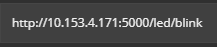

# Led-Api

### How to run this on Your Raspberry
Make sure You have installed Dotnet SDK on Your computer.
Put the led on GPIO pin 21 on the Raspberry.

Open cmd and navigate to Your folder containing this project.
Write ``` dotnet publish -r linux-arm -o LedApi  ``` where the last word(LedApi) is the name of the output folder.

### Get the file copied to the Raspberry
Open [WinSCP](https://winscp.net/eng/download.php) and connect to Your Raspberry.
Find a suitable folder on the raspberry and copy the output folder from Your computer to the Raspberry.

### Start the Api on the Raspberry
Navigate to the folder of the files You just copied using a terminal program. I´m, using [Putty](https://www.chiark.greenend.org.uk/~sgtatham/putty/latest.html).

Write ``` dotnet Led-Api.dll --urls http://0.0.0.0:5000 ``` 
The last command urls http:// 0.0.0.0:5000 opens the api to be reached over the network.

If everything worked out ok You should see this in Your terminal program: 


### Try it out
If everything is working You should be able to call the api in any web browser with: the.ip.of.raspberry:5000/led/blink and the led should light up for three seconds.



### Endpoints
The Api has three endpoints.

/led/blink - to light up the led for three seconds.

/led/on - turn the led on.

/led/off - turn the led off.

#### To exit the program push Ctrl + c in the terminal program.
